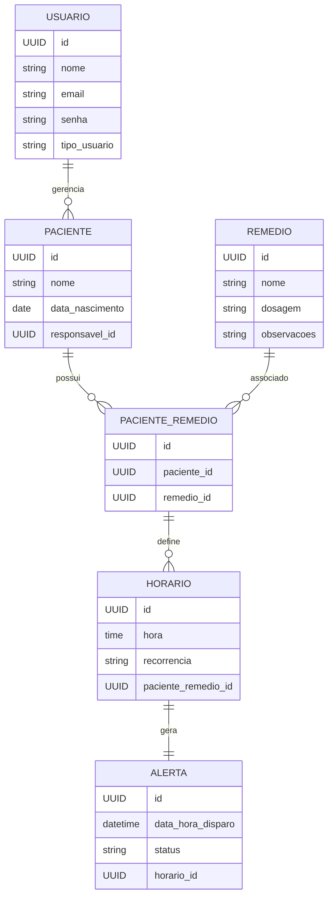

# Criação do contexto técnico do projeto (`.ai/`)

> Você está operando em **Agent Mode**, com permissão para criar arquivos e escrever documentação.
>
> Atue como um **Full Stack Engineer / Tech Lead Java e Angular**, responsável por preparar o **contexto técnico e arquitetural** de um projeto que será implementado posteriormente por outro agente.
>
> Pense como se estivesse escrevendo documentação interna para um time real.

---

## 🎯 Objetivo

Criar uma pasta `.ai/` na raiz do projeto contendo documentos **claros, prescritivos e não genéricos**, que definem:

* padrões de código
* decisões arquiteturais
* stack tecnológica aprovada
* regras de negócio e domínio

Esses arquivos **não são explicativos**; eles **definem regras** que devem ser seguidas.

---

## 📁 Estrutura obrigatória

Criar exatamente a seguinte estrutura:

```
.ai/
├── standards.md
├── architecture.md
├── tech-stack.md
└── business-rules.md
```

---

## 📄 Conteúdo esperado (DETALHADO)

### 🔹 `.ai/standards.md` — Padrões de código e estilo

Defina regras **concretas**, incluindo:

* Java 25 como versão mínima

* Uso de:
  * `record` para DTOs imutáveis
  * `Optional` apenas em retornos, nunca em campos
  * `Stream API` para filtros e ordenações

* Convenções REST:
  * Controllers finos
  * Lógica apenas em Services

* Organização de pacotes:

  ```
  controller
  service
  repository
  domain
  dto
  config
  error
  ```
* Padrão de resposta JSON consistente
* Validações usando `jakarta.validation`
* Código legível > abstrações complexas
* Testes são desejáveis, mas não obrigatórios

* Angular 21 como cersão mínima

* Código limpo, legibilidade > abstrações complexas.

* Adicionar logs em todo fluxo para monitoração.

Evite qualquer linguagem vaga como “quando possível”.

---

### 🔹 `.ai/architecture.md` — Arquitetura e decisões

Descreva explicitamente:

* Arquitetura em camadas (Spring MVC)
* Banco de dados MYSQL
* Uso do docker para criação da imagem do banco de dados
* Nenhuma chamada HTTP externa permitida
* O projeto **não é**:

  * um crawler
  * um agregador real
  * um proxy para APIs externas

* Criar o projeto Backend em uma pasta isolada
* Criar o projeto frontend em uma pasta isolada
---

### 🔹 `.ai/tech-stack.md` — Stack tecnológica (PRESCRITIVO)

Defina explicitamente:

* **Angular 21**

* **Java 25**
* Spring Boot (compatível com Java 25)
* Build tool: Maven
* Dependências aprovadas:

  * spring-boot-starter-web
  * spring-boot-starter-validation
  * springdoc-openapi
  * jackson-databind
  * mysql-connector-j
* Dependências opcionais:


  * WebClient / RestTemplate
  * Jsoup / Selenium
  * Feign
* Configuração via:

  * `application.yml`

Declare claramente:

> Qualquer dependência fora desta lista não deve ser utilizada.

---

### 🔹 `.ai/business-rules.md` — Regras de negócio

Documente regras claras:

## Funcionalidades Principais
- **Gestão de usuários**: Cadastro e login, controle de perfis (responsável / paciente), recuperação de senha, autenticação e autorização.
- **Gestão de Pacientes**: Cadastro de pacientes (feito pelo responsável), associação paciente e responsável, visualização do histórico do paciente.
- **Gestão de Medicamentos**: Cadastro de remédios (nome, dosagem, observações), associação de remédios a pacientes.
- **Gestão de Horários**: Cadastro de hirários para cada remédio, suporte a múltiplis horários por dia, definição de recorrência (diário, semanal, mensal, etc.)
- **Gestão de Alertas**: Geração de alertas baseados nos horários cadastrados, notificação no horário correto, confirmação de uso do remédio (tomado / não tomado).

## Tipos de usuários e permissões
- **Responsável**: Cadastrar e gerenciar pacientes, cadastrar e editar remédios, associar remédios e horários aos pacientes, visualizar alertas e histórico, receber notificações.
- **Paciente**: Visualizar seus remédios e horários, receber alertas, confirmar se tomou ou não o remédio, visualizar histórico pessoal.

## Estilo da arquitetura:
Frontend (Web/Mobile: login, pacientes, remédios, alertas) → REST/JSON → Backend (API REST: autenticação, regras de negócio, scheduler de alertas, permissões) → ORM/SQL → Banco de Dados Relacional (usuários, pacientes, remédios, horários, alertas)

## Entidades principais e relacionamentos


* Domínio: Aplicação para controle/alertas de medicamentos.
* Endpoints existentes:
- `POST api/auth/login`: Login para responsáveis e pacientes.
- `POST api/auth/register`: Registro de responsáveis e pacientes.
- `POST api/pacientes`: Cadastro de pacientes.
- `GET api/pacientes`: Listagem de pacientes.
- `GET api/pacientes/{id}`: Detalhes de um paciente.
- `PUT api/pacientes/{id}`: Atualização de um paciente.
- `DELETE api/pacientes/{id}`: Exclusão de um paciente.
- `POST api/remedios`: Cadastro de remédios.
- `GET api/remedios`: Listagem de remédios.
- `PUT api/remedios/{id}`: Atualização de um remédio.
- `DELETE api/remedios/{id}`: Exclusão de um remédio.
- `POST api/pacientes/{id}/remedios`: Associação de um remédio a um paciente.
- `GET api/pacientes/{id}/remedios`: Listagem de remédios associados a um paciente.
- `DELETE api/pacientes/{id}/remedios/{remedioId}`: Remoção de um remédio de um paciente.
- `POST api/horarios`: Cadastro de horários.
- `GET api/horarios`: Listagem de horários.
- `PUT api/horarios/{id}`: Atualização de um horário.
- `DELETE api/horarios/{id}`: Exclusão de um horário.
- `GET api/pacientes/{id}/horários`: Listagem de horários associados a um paciente.
- `GET api/alertas`: Listagem de alertas.
- `GET api/alertas/{id}`: Detalhes de um alerta.
- `PUT api/alertas/{id}`: Atualização de um alerta.
- `DELETE api/alertas/{id}`: Exclusão de um alerta.
- `POST api/alertas/{id}/confirmar`: Confirmar o alerta.


* Configurada via `application.yml`

---

## ⚠️ Regras finais

* Escreva os documentos pensando em **outro agente**
* Seja específico e direto
* Não use frases genéricas
* Não antecipe implementação

---

## ✅ Entregável

* Pasta `.ai/` criada
* Quatro arquivos preenchidos conforme especificado
* Ao final, apresente:

  * Lista dos arquivos criados
  * Um resumo objetivo de cada documento